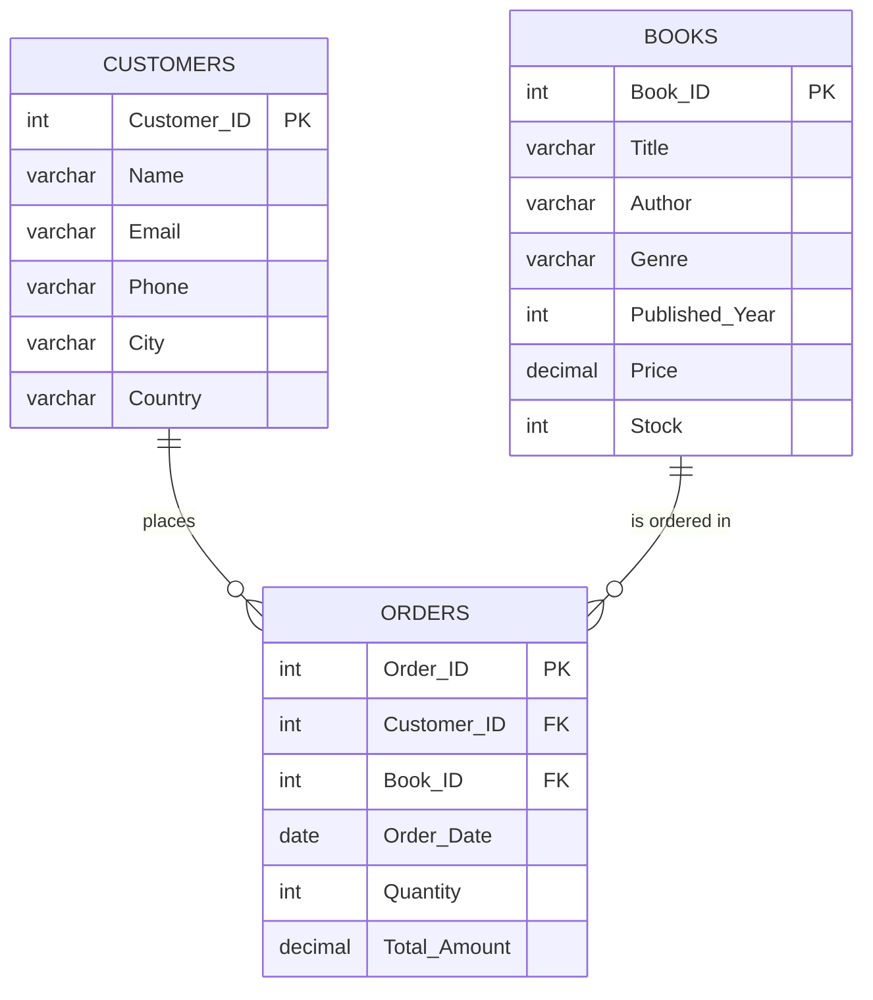

# 📚 Online Bookstore Sales Analysis (SQL)


An end-to-end SQL portfolio project built in **MySQL Workbench**. It analyzes the sales of an online bookstore across three related tables to answer practical business questions: which books and genres sell the most, who the best customers are, how much revenue the store generates, and how much stock is left.

> **Credit:** The dataset and the 20 project questions come from the SQL series by [Satish Dhawale](https://github.com/SatishDhawale/SQL_Resume_Project). I wrote and solved the queries myself in MySQL as a learning project. Thank you, sir, for the clear and practical guidance. 🙏

---

## 🎯 Objectives

- Design a relational schema with primary and foreign keys
- Import CSV data into MySQL
- Answer 20 business questions using SQL
- Turn raw data into insights about sales, customers and inventory

## 🗂️ Dataset

| Table | Rows | Columns |
|-------|------|---------|
| `Books` | 500 | Book_ID, Title, Author, Genre, Published_Year, Price, Stock |
| `Customers` | 500 | Customer_ID, Name, Email, Phone, City, Country |
| `Orders` | 500 | Order_ID, Customer_ID, Book_ID, Order_Date, Quantity, Total_Amount |

The data is a sample/synthetic dataset from the tutorial (orders span Dec 2022 to Dec 2024).



## 🛠️ Tools & Skills

- **MySQL 8 / MySQL Workbench**
- `CREATE TABLE`, primary and foreign keys, `LOAD DATA LOCAL INFILE`
- `JOIN` (inner and left), `GROUP BY`, `HAVING`
- Aggregations: `SUM`, `AVG`, `COUNT`, `MIN`
- Subqueries, `DISTINCT`, `ORDER BY`, `LIMIT`, `COALESCE`

## 📁 Project Structure

```
Online-Bookstore-SQL-Analysis/
├── data/
│   ├── Books.csv
│   ├── Customers.csv
│   └── Orders.csv
├── sql/
│   └── OnlineBookstore.sql     # schema + import + all 20 queries
├── images/
│   └── cover.png
└── README.md
```

## 🚀 How to Run

1. Clone or download this repository.
2. Open `sql/OnlineBookstore.sql` in MySQL Workbench.
3. Update the three `LOAD DATA LOCAL INFILE` paths to the location of the `data/` folder on your computer. Use forward slashes, for example `C:/Users/you/Online-Bookstore-SQL-Analysis/data/Books.csv`.
4. Enable `local_infile` (needed for the import):
   - Server: `SET GLOBAL local_infile = 1;`
   - Client: in Workbench, Edit Connection, Advanced tab, Others box, add `OPT_LOCAL_INFILE=1`, then reconnect.
5. Run the whole script with `Ctrl + Shift + Enter`.

> Alternative: if `LOAD DATA` gives you trouble, use Workbench's **Table Data Import Wizard** on each CSV instead.

---

## ❓ Business Questions Solved

### Basic (11)

| # | Question | Result |
|---|----------|--------|
| 1 | All books in the "Fiction" genre | 60 books |
| 2 | Books published after 1950 | 292 books |
| 3 | Customers from Canada | 3 customers |
| 4 | Orders placed in November 2023 | 25 orders |
| 5 | Total stock of books available | 25,056 units |
| 6 | Most expensive book | *Proactive system-worthy orchestration* ($49.98) |
| 7 | Orders with quantity greater than 1 | 438 orders |
| 8 | Orders with total amount above $20 | 473 orders |
| 9 | All genres in the Books table | 7 genres |
| 10 | Book(s) with the lowest stock | 5 books have 0 stock |
| 11 | Total revenue from all orders | **$75,628.66** |

### Advanced (9)

| # | Question | Result |
|---|----------|--------|
| 1 | Books sold per genre | Mystery leads with 504 units |
| 2 | Average price of "Fantasy" books | $25.98 |
| 3 | Customers with at least 2 orders | 139 customers |
| 4 | Most frequently ordered book | *Realigned multi-tasking installation* (4 orders, 28 units) |
| 5 | Top 3 most expensive Fantasy books | $49.90, $49.23, $48.97 |
| 6 | Total quantity sold per author | Patrick Contreras leads with 28 units |
| 7 | Cities of customers who spent over $30 | See query output |
| 8 | Customer who spent the most | Kim Turner ($1,398.90) |
| 9 | Stock remaining after fulfilling all orders | 22,359 of 25,056 units |

*(Q4 note: seven books are tied at 4 orders each, so ties are broken by total quantity sold.)*

---

## 📊 Key Insights

- **Mystery** is the best-selling genre by volume (504 units), followed by Science Fiction (447) and Fantasy (446).
- **Romance** generates the highest revenue (about $13.1K) despite ranking 4th in units sold, so its average price per book is higher.
- **Fiction** is the weakest genre on both units (225) and revenue (about $7.3K).
- The store sold **2,697 books across 500 orders**, for $75.6K in revenue.
- **139 customers** ordered at least twice, a healthy base of repeat buyers.
- **5 titles are completely out of stock**, a clear restocking priority.

## 💡 Ideas for Next Steps

- Build a Power BI or Tableau dashboard on top of this data
- Add month-over-month and year-over-year sales trends using window functions
- Customer segmentation (e.g. RFM analysis)

## 📬 Connect

If you have feedback or suggestions, feel free to reach out.

- LinkedIn: *add your link here*
- GitHub: *add your profile link here*

⭐ If you found this useful, please star the repo!
